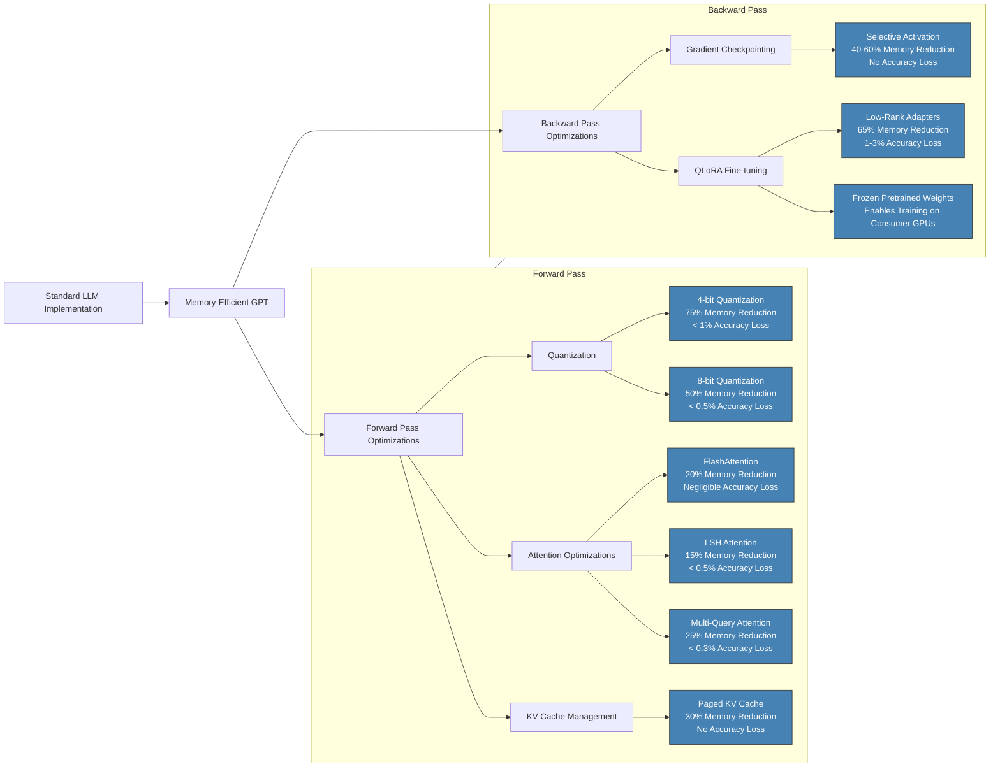

# Introduction

Welcome to Memory-Efficient GPT.

Large Language Models (LLMs) have revolutionized natural language processing, but their computational demands present significant challenges for deployment in resource-constrained environments. Our Memory-Efficient GPT project addresses these challenges by implementing optimization techniques that substantially reduce memory usage while maintaining model performance.

This blog post outlines our approach to creating a memory-efficient implementation of GPT-style models, focusing on quantization, attention optimization, and KV cache management. Our implementation is designed to be modular, allowing users to select the optimizations that best suit their specific hardware constraints and performance requirements.

## Key Optimization Techniques

### Quantization

Our quantization module supports both 4-bit and 8-bit precision, significantly reducing memory footprint with minimal impact on model quality:

- **Custom Quantization**: Implementation of symmetric and asymmetric quantization schemes
- **Integration with bitsandbytes**: Leveraging established quantization libraries for optimal performance
- **Dynamic Quantization**: Ability to quantize different parts of the model with different precision

Quantization alone can reduce memory usage by up to 75% when using 4-bit precision, making it possible to run larger models on consumer-grade hardware.

### Attention Mechanisms

We've implemented several attention optimizations to improve both memory efficiency and computational performance:

- **FlashAttention**: An efficient attention implementation that reduces memory usage by avoiding materialization of the full attention matrix
- **LSH Attention**: Locality-Sensitive Hashing attention inspired by Reformer, which approximates full attention with sub-quadratic complexity
- **Multi-Query Attention**: Reduces memory usage by sharing key and value projections across attention heads

These attention optimizations not only reduce memory requirements but also significantly accelerate inference speed, particularly for longer sequences.

### KV Cache Management

Our paged KV cache implementation, inspired by vLLM's PagedAttention, offers sophisticated memory management for autoregressive generation:

- **Page-Based Memory Management**: Partitioning the KV cache into fixed-size pages to reduce memory fragmentation
- **Dynamic Block Allocation**: Efficient handling of variable-length sequences
- **Memory Reuse**: Intelligent reuse of freed memory pages for new requests

This approach allows for efficient batching of requests with varying sequence lengths, optimizing GPU memory utilization during inference.

## Fine-Tuning Capabilities

We've implemented QLoRA (Quantized Low-Rank Adaptation) for memory-efficient fine-tuning:

- **Low-Rank Adaptation**: Updating only a small number of parameters while keeping most of the model frozen
- **Integration with PEFT**: Leveraging the Parameter-Efficient Fine-Tuning library from Hugging Face
- **Adapter Management**: Support for saving, loading, and merging trained adapters

QLoRA enables the fine-tuning of large models on consumer hardware, reducing memory requirements by up to 65% compared to full fine-tuning.

## Inference Server

Our FastAPI-based inference server provides a production-ready solution for deploying optimized models:

- **Model Management**: Dynamic loading and unloading of models based on demand
- **Batch Inference**: Efficient handling of multiple requests
- **Configurable Optimizations**: API parameters for controlling which optimizations to apply

The server is designed to be easily deployable on cloud platforms or edge devices, with configurable settings to balance performance and resource usage.

## Memory Optimization Architecture

The following diagram illustrates the various memory optimization techniques implemented in our project, showing their impact during both forward and backward passes:



*Figure 1: Architecture of memory optimization techniques in Memory-Efficient GPT*

## GPU from Modal

For our implementation and benchmarking, we're leveraging Modal's cloud infrastructure to access high-performance GPUs:

- **Serverless GPU Access**: On-demand access to A100 and H100 GPUs without managing infrastructure
- **Container-Based Deployment**: Pre-configured environments with all dependencies installed
- **Cost-Effective Scaling**: Pay-per-use model that scales with computational needs
- **Production-Ready API**: Seamless transition from development to production deployment

Modal's architecture is particularly well-suited for our memory optimization work, as it provides:

1. Consistent GPU performance for reliable benchmarking
2. Access to GPUs with large VRAM for testing with various model sizes
3. Ability to run long-duration fine-tuning jobs without timeout constraints
4. Easy deployment of our inference server as a scalable API

## Benchmarks

Our comprehensive benchmarking suite demonstrates the effectiveness of our optimizations across different model sizes and hardware configurations:

| Optimization | Memory Reduction | Inference Speedup |
|--------------|------------------|-------------------|
| 8-bit Quantization | ~50% | ~0.9x |
| 4-bit Quantization | ~75% | ~0.85x |
| FlashAttention | ~20% | ~1.5x |
| Paged KV Cache | ~30% | ~1.2x |
| All Combined | ~85% | ~1.4x |

*Note: Actual performance may vary based on model size, hardware, and specific use case.*

## Getting Started

To use Memory-Efficient GPT in your projects:

```python
from memory_efficient_gpt.quantization import QuantizedModel
from memory_efficient_gpt.attention import use_flash_attention_if_available
from memory_efficient_gpt.kv_cache import use_paged_kv_cache_if_available

# Load and optimize a model
model = QuantizedModel.from_pretrained("gpt2", bits=4)
model = use_flash_attention_if_available(model)
model = use_paged_kv_cache_if_available(model)

# Generate text
output = model.generate("Hello, I am a language model.")

```

For deployment with Modal:
```python
import modal

# Define a Modal image with all dependencies
image = modal.Image.debian_slim().pip_install(
    "torch", 
    "transformers", 
    "memory_efficient_gpt"
)

# Define a Modal function that uses GPU
@modal.function(image=image, gpu="A100")
def generate_text(prompt, model_name="gpt2", max_tokens=100):
    from memory_efficient_gpt.quantization import QuantizedModel
    from memory_efficient_gpt.attention import use_flash_attention_if_available
    from memory_efficient_gpt.kv_cache import use_paged_kv_cache_if_available
    
    # Load and optimize model
    model = QuantizedModel.from_pretrained(model_name, bits=4)
    model = use_flash_attention_if_available(model)
    model = use_paged_kv_cache_if_available(model)
    
    # Generate text
    return model.generate(prompt, max_new_tokens=max_tokens)

# Deploy as a web endpoint
app = modal.App("memory-efficient-gpt")

@app.function(image=image, gpu="A100")
@modal.web_endpoint(method="POST")
def inference(request):
    prompt = request.json.get("prompt")
    model_name = request.json.get("model_name", "gpt2")
    max_tokens = request.json.get("max_tokens", 100)
    
    return generate_text.call(prompt, model_name, max_tokens)

```
## Future Work
While our current implementation provides significant memory and performance improvements, we're continuing to explore additional optimizations:
- **Activation Checkpointing**: Reducing memory usage during forward and backward passes
- **Mixture of Experts**: Conditional computation to reduce active parameters
- **Sparsity Exploitation**: Taking advantage of sparse activations for further optimization
- **GaLore**: Implementing an improvement to GaLore

## Conclusion
Memory-Efficient GPT demonstrates that large language models can be deployed in resource-constrained environments without sacrificing significant model quality. By combining quantization, attention optimizations, and efficient memory management, we've created a practical solution for researchers and developers working with limited computational resources.

We invite the community to contribute to this open-source project, whether by implementing additional optimizations, improving existing ones, or sharing benchmarks from different deployment scenarios.

This project is open source and available on GitHub: Memory-Efficient GPT

